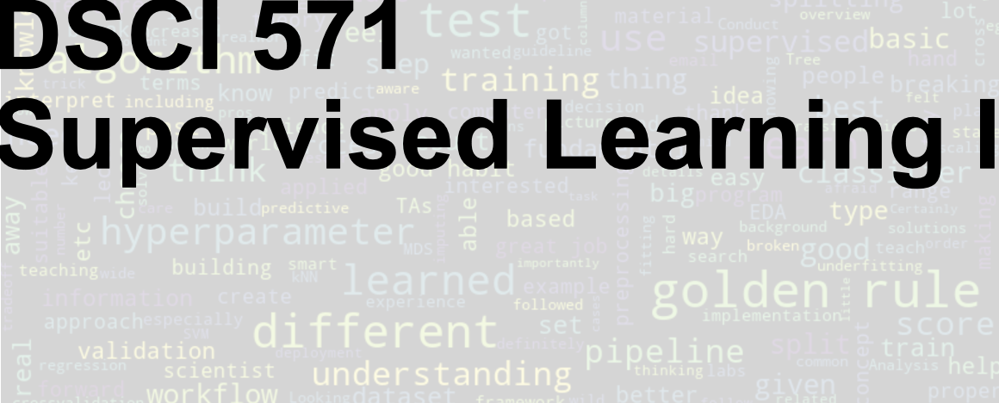

# 

In this course we will focus on basic machine learning concepts such as data splitting, cross-validation, generalization error, overfitting, the fundamental trade-off, the golden rule, and data preprocessing. You will also be exposed to common machine learning algorithms such as decision trees, $k$-nearest neighbours, SVMs, naive Bayes, and logistic regression using [the scikit-learn framework](https://scikit-learn.org/stable/).

## LICENSE 
© 2022 Varada Kolhatkar and Mike Gelbart

Software licensed under [the MIT License](https://spdx.org/licenses/MIT.html), non-software content licensed under [the Creative Commons Attribution-NonCommercial-ShareAlike 4.0 International (CC BY-NC-SA 4.0) License](https://creativecommons.org/licenses/by-nc-sa/4.0/). See the [license file](LICENSE.md) for more information.

## Important links 

- [YouTube videos](https://www.youtube.com/playlist?list=PLHofvQE1VlGtZoAULxcHb7lOsMved0CuM)
- [Class + office hours calendar](https://ubc-mds.github.io/calendar/)

## Course learning outcomes    

<details>
  <summary>Click to expand!</summary>
    
By the end of the course, students are expected to be able to:
- describe supervised learning and identify what kind of tasks it is suitable for;
- explain common machine learning concepts such as classification and regression, data splitting, overfitting, parameters and hyperparameters, and the fundamental trade-off in machine learning;
- identify when and why to apply data pre-processing techniques such as imputation, scaling, ordinal encoding, and one-hot encoding;
- broadly describe the intuition behind common machine learning algorithms, including decision trees, K-nearest neighbours, naive Bayes, and logistic regression;
- use Python and the `scikit-learn` package to responsibly develop end-to-end supervised machine learning pipelines on real-world datasets
</details>

## Deliverables

<details>
  <summary>Click to expand!</summary>
    
The following deliverables will determine your course grade:

| Assessment       | Weight  | Where to submit|
| :---:            | :---:   |:---:  | 
| Lab Assignment 1 | 15%     | [Gradescope](https://www.gradescope.ca/courses/5475) |
| Lab Assignment 2 | 15%     | [Gradescope](https://www.gradescope.ca/courses/5475) |
| Lab Assignment 3 | 15%     | [Gradescope](https://www.gradescope.ca/courses/5475) |
| Lab Assignment 4 | 15%     | [Gradescope](https://www.gradescope.ca/courses/5475) |
| Quiz 1           | 20%     | [Canvas](https://canvas.ubc.ca/courses/78167)     |
| Quiz 2           | 20%     | [Canvas](https://canvas.ubc.ca/courses/78167)     |

See [Calendar](https://ubc-mds.github.io/calendar/) for the due dates. 
</details>

## Teaching Team
<details>
  <summary>Click to expand!</summary>

    
| Role           | Name             | Slack Handle | GHE Handle |
| ---------------- | -------------- | :----------: | :--------: |
| Lecture Instructor | Varada Kolhatkar | `@varada`    | `@kvarada` |
| Lab Instructor     | Varada Kolhatkar | `@varada`    | `@kvarada` |
| Teaching Assistant | Sana Ayromlou  | | |
| Teaching Assistant | Keng Man Glenn Chang | | |
| Teaching Assistant | Colby DeLisle | | |
| Teaching Assistant | Farnoosh Hashemi| | |
| Teaching Assistant | Alireza Iranpour| | |
| Teaching Assistant | Faeze Keshavarz | | |
| Teaching Assistant | Daniel Ramandi  | | |
    
</details>
   
## Lectures 

### Format
<details>
  <summary>Click to expand!</summary>

This class will follow a semi-flipped classroom format. You will be required to watch a few pre-recorded videos (~30 to ~50 min long) before most of the classes. During lecture time we will focus on more examples, exercises, Q&A, discussions, demos, and class activities. It's optional but highly recommended to download the appropriate datasets provided below and put them under your local `lectures/data` directory, and run the lecture Jupyter notebooks on your own and experiment with the code. 
</details>

### Lecture schedule

This course occurs during **Block 2** in the 2022/23 school year.


| Lecture  | Topic  | Assigned videos | Resources and optional readings |
|-------|------------|-----------|-----------|
|      | [Course information](lectures/00_course-information.ipynb) |  📹 Pre-watch: [1.0](https://youtu.be/-1hTcS5ZE4w) | |
|   1   | [Terminology, baselines, decision trees](lectures/01_terminology-baselines-decision-trees.ipynb) | 📹 Pre-watch: [2.1](https://youtu.be/YNT8n4cXu4A), [2.2](https://youtu.be/6eT5cLL-2Vc), [2.3](https://youtu.be/Hcf19Ij35rA), [2.4](https://youtu.be/KEtsfXn4w2E) | |
|   2   | [ML fundamentals](lectures/02_ml-fundamentals.ipynb) | 📹 Pre-watch: [3.1](https://youtu.be/iS2hsRRlc2M), [3.2](https://youtu.be/h2AEobwcUQw), [3.3](https://youtu.be/4cv8VYonepA), [3.4](https://youtu.be/Ihay8yE5KTI) | [An article by Pedro Domingos](https://homes.cs.washington.edu/~pedrod/papers/cacm12.pdf) |
|   3   | [$k$-NNs, SVM RBF](lectures/03_kNNs-SVM-RBF.ipynb) | 📹 Pre-watch: [4.1](https://youtu.be/hCa3EXEUmQk), [4.2](https://youtu.be/bENDqXKJLmg), [4.3](https://youtu.be/IRGbqi5S9gQ), [4.4](https://youtu.be/ic_zqOhi020), [5.1](https://youtu.be/xx9HlmzORRk) | | 
|   4   | [Preprocessing, pipelines, column transformer](lectures/04_preprocessing-pipelines-column-transformer.ipynb) |  📹 Pre-watch: [5.2](https://youtu.be/G2IXbVzKlt8), [5.3](https://youtu.be/nWTce7WJSd4), [5.4](https://youtu.be/2mJ9rAhMMl0), [6.1](https://youtu.be/to2mukSyvLk) | |
|   5   | [More preprocessing, text features](lectures/05_more-preprocessing-text-feats.ipynb) | 📹 Pre-watch: [6.2](https://youtu.be/hteVvLwrWZ4) |
|   6   | [Hyperparameter optimization, optimization bias](lectures/06_hyperparameter-optimization.ipynb) |  📹 Pre-watch: [8.1](https://youtu.be/lMWdHZSZMk8), [8.2](https://youtu.be/Z9a9XZ0vQv0) |
|   7   | [Naive Bayes](lectures/07_naive-Bayes.ipynb) | None | <li>[Conditional probability visualization](https://setosa.io/ev/conditional-probability/)</li><li>[Naive Bayes chapter, Jurafsky and Martin](https://web.stanford.edu/~jurafsky/slp3/4.pdf)</li> |
|   8   | [Logistic Regression, multi-class classification](lectures/08_linear-models.ipynb) | 📹 Pre-watch: [7.1](https://youtu.be/HXd1U2q4VFA), [7.2](https://youtu.be/56L5z_t22qE), [7.3](https://youtu.be/_OAK5KiGLg0) | |

### Datasets
Here is the list of [Kaggle](https://www.kaggle.com/) datasets we'll use in this class. 
- [SMS Spam Collection Dataset](https://www.kaggle.com/uciml/sms-spam-collection-dataset)
- [Indian Liver Patient Records](https://www.kaggle.com/uciml/indian-liver-patient-records)
- [IMDB movie reviews](https://www.kaggle.com/utathya/imdb-review-dataset)
- [House Sales in King County](https://www.kaggle.com/harlfoxem/housesalesprediction)
- [The adult census dataset](https://www.kaggle.com/uciml/adult-census-income#)
- [Spotify Song Attributes](https://www.kaggle.com/geomack/spotifyclassification/home)
- [California Housing](https://www.kaggle.com/harrywang/housing?select=housing.csv)

If you want to be extra prepared, you may want to download these datasets in advance and save them under the `lectures/data` directory in your local copy of the repository. 

## Labs 
During labs, you will be given time to work on your own or in groups. There will be a lot of opportunity for discussion and getting help during lab sessions. (Usually I enjoy labs a lot. It's also an opportunity for me to know you a bit better 🙂.) 


## Installation
 
We are providing you with a `conda` environment file which is available [here](env-dsci-571.yaml). You can download this file and create a conda environment for the course and activate it as follows. 

```
conda env create -f env-dsci-571.yaml
conda activate 571
```
In order to use this environment in `Jupyter`, you will have to install `nb_conda_kernels` in the environment where you have installed `Jupyter` (typically the `base` environment). You will then be able to select this new environment in `Jupyter`. For more details on this, refer to "Making environments work well with JupyterLab section" in your [521 lecture 6](https://pages.github.ubc.ca/fdandrea/521_lecture6/slides.html#51).

I've only tried installing this environment file on a couple of machines, and it's possible that you will encounter problems with some of the packages from the `yml` file when you run the commands above. This is not unusual. It often means that the package with the given version is not available for your operating system via `conda` yet. There are a couple of options for you when this happens:
1. Get rid of the line with that package from the `yml` file.
2. Create the environment without that package. 
3. Activate the environment and install the package manually either with `conda install` or `pip install` in the environment.   

_Note that this is not a complete list of the packages we'll be using in the course and there might be a few packages you will be installing using `conda install` later in the course. But this is a good enough list to get you started._ 

## Course communication
<details>
  <summary>Click to expand!</summary>

We all are here to help you learn and succeed in the course and the program. Here is how we'll be communicating with each other during the course. 

### Clarifications on the lecture notes or lab questions

If there is any clarification on the lecture material or lab questions, I'll open an issue in the [course repository](https://github.ubc.ca/MDS-2021-22/DSCI_571_sup-learn-1_students) and tag you. **It is your responsibility to read the messages whenever you are tagged.** (I know that there are too many things for you to keep track of. You do not have to read all the messages but please make sure to carefully read the messages whenever you are tagged.) 

### Questions on lecture material or labs

If you have questions about the lecture material or lab questions please post them on the course Slack channel rather than direct messaging me or the TAs. Here are the advantages of doing so: 
- You'll get a quicker response. 
- Your classmates will benefit from the discussion. 

When you ask your question on the course channel, please avoid tagging the instructor unless it's specific for the instructor (e.g., if you notice some mistake in the lecture notes). If you tag a specific person, other teaching team members or your colleagues are discouraged to respond. This is decrease the response rate on the channel. 

Please use some consistent convention when you ask questions on Slack to facilitate easy search for others or future you. For example, if you want to ask a question on Exercise 3.2 from Lab 1, start your post with the label `lab1-ex2.3`. Or if you have a question on lecture 2 material, start your post with the label `lecture2`. Once the question is answered/solved, you can add "(solved)" tag before the label (e.g., (solved) `lab1-ex2.3`. Do not delete your post even if you figure out the answer on your own. The question and the discussion can still be beneficial to others.  

### Questions related to grading

For each deliverable, after I return grades, I'll let you know who has graded what in our course Slack by opening an issue in the course GitHub repository. If you have questions related to grading
- First, make sure your concerns are reasonable (read the ["Reasonable grading concerns" policy](https://ubc-mds.github.io/policies/)). 
- If you believe that your request is reasonable, open a regrade request on Gradescope. 
- If you are unable to resolve the issue with the TA, send a Slack message to the instructor, including the appropriate TA in the conversation. 

### Questions related to your personal situation or talking about sensitive information
 
I am open for a conversation with you. If you want to talk about anything sensitive, please direct message me on Slack (and tag me) rather than posting it on the course channel. It might take a while for me to get back to you, but I'll try my best to respond as soon as possible. 

</details>

## Working during the COVID-19 global pandemic
<details>
  <summary>Click to expand!</summary>
    
We are working together on this course during this transition period between hybrid to in-person teaching and learning. Everyone is struggling to some extent. If you tell me you are having trouble, I am not going to judge you or think less of you. I hope you will extend me the same grace! Let's try to be open with each other and help each other. 

Here are some ground rules:

- If you are unable to submit a deliverable on time, please reach out **before** the deliverable is due.
- If you need extra support, the teaching team is here to work with you. Our goal is to help each of you succeed in the course.
- If you are struggling with the material, getting back to in-person teaching and learning, or anything else, please reach out. I will try to find time and listen to you empathetically.
- If I am unable to help you, I might know someone who can. UBC has some [great student support resources](https://students.ubc.ca/support).

### [Covid Safety at UBC](https://srs.ubc.ca/covid-19/ubc-campus-rules-guidance-documents/#COVID-19%20Campus%20Rules)

Please read [Covid Campus Rules](https://srs.ubc.ca/covid-19/ubc-campus-rules-guidance-documents/#COVID-19%20Campus%20Rules).  

**Masks:** This class is going to be in person. UBC no longer requires students, faculty and staff to wear non-medical masks, but continues to recommend that masks be worn in indoor public spaces. 

**Your personal health:**
If you are ill or believe you have COVID-19 symptoms or been exposed to SARS-CoV-2 use the [Thrive Health](https://bc.thrive.health/covid19/en) self-assessment tool for guidance, or download the [BC COVID-19 Support App](https://welcome.thrive.health/bc-covid19-app) for iOS or Android device and follow the instructions provided. Follow the advice from [Public Health](https://www2.gov.bc.ca/gov/content/covid-19/info/restrictions).

Stay home if you have recently tested positive for COVID-19 or are required to quarantine. You can check [this website](http://www.bccdc.ca/health-info/diseases-conditions/covid-19/self-isolation#Who) to find out if you should self-isolate or self-monitor. If you are unable to submit a deliverable on time or unable to appear for an in-person quiz, check out [MDS policies](https://ubc-mds.github.io/policies/) on academic concession and remote quiz requests. 

Your precautions will help reduce risk and keep everyone safer. In this class, the marking scheme is intended to provide flexibility so that you can prioritize your health and still be able to succeed: 
- All course notes will be provided online. 
- All homework assignments can be done and handed in online. 
- All exams will be held online.  
- Most of the class activity will be video recorded and will be made available to you. 
- Before each class, I'll also try to post some [videos on YouTube](https://www.youtube.com/watch?v=-1hTcS5ZE4w&list=PLHofvQE1VlGtZoAULxcHb7lOsMved0CuM) to facilitate hybrid learning. 
- There will be at least a few office hours which will be held online. 
</details>
    
## Reference Material
<details>
  <summary>Click to expand!</summary>
    
### Books
* [A Course in Machine Learning (CIML)](http://ciml.info/) by Hal Daumé III (also relevant for DSCI 572, 573, 575, 563)
* Introduction to Machine Learning with Python: A Guide for Data Scientists by Andreas C. Mueller and Sarah Guido.
* [An Introduction to Statistical
Learning](https://hastie.su.domains/ISLR2/ISLRv2_website.pdf)
* [The Elements of Statistical Learning (ESL)](https://web.stanford.edu/~hastie/Papers/ESLII.pdf)
* [Data Mining: Practical Machine Learning Tools and Techniques (PMLTT)](https://www.wi.hs-wismar.de/~cleve/vorl/projects/dm/ss13/HierarClustern/Literatur/WittenFrank-DM-3rd.pdf)
* Artificial intelligence: A Modern Approach by Russell, Stuart and Peter Norvig.
* [Artificial Intelligence 2E: Foundations of Computational Agents](https://artint.info/2e/html/ArtInt2e.htm) (2017) by David Poole and Alan Mackworth (of UBC!).

### Online courses

* [CPSC 330](https://github.com/UBC-CS/cpsc330)<br>
I'm currently teaching an undergrad course on applied machine learning. Unlike DSCI 571, CPSC 330 is a semester-long course but there is a lot of overlap and sharing of notes between these courses. 
* [Mike's CPSC 340](https://ubc-cs.github.io/cpsc340/)
* [Machine Learning](https://www.coursera.org/learn/machine-learning) (Andrew Ng's famous Coursera course)
* [Foundations of Machine Learning](https://bloomberg.github.io/foml/#home) online course from Bloomberg.
* [Machine Learning Exercises In Python, Part 1](http://www.johnwittenauer.net/machine-learning-exercises-in-python-part-1/) (translation of Andrew Ng's course to Python, also relevant for DSCI 561, 572, 563)

### Misc

* [A Visual Introduction to Machine Learning (Part 1)](http://www.r2d3.us/visual-intro-to-machine-learning-part-1/)
* [A Few Useful Things to Know About Machine Learning](https://homes.cs.washington.edu/~pedrod/papers/cacm12.pdf) (an article by Pedro Domingos)
* [Metacademy](https://metacademy.org/) (sort of like a concept map for machine learning, with suggested resources)
* [Machine Learning
  101](https://docs.google.com/presentation/d/1kSuQyW5DTnkVaZEjGYCkfOxvzCqGEFzWBy4e9Uedd9k/present?slide=id.g168a3288f7_0_58)
  (slides by Jason Mayes, engineer at Google)
    
</details>     

## Policies

Please see the general [MDS policies](https://ubc-mds.github.io/policies/).
